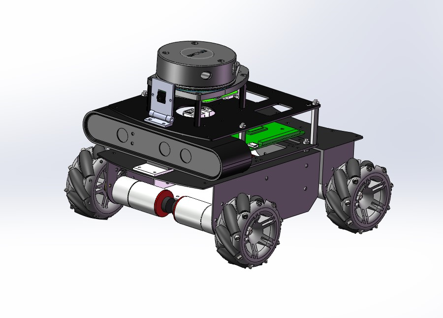
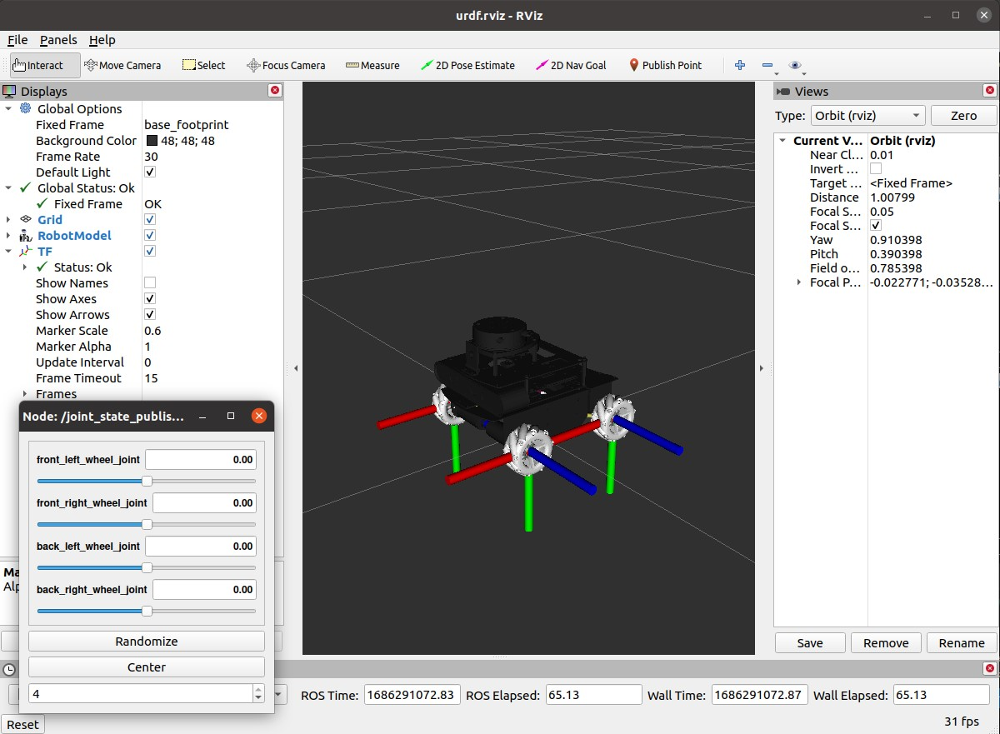
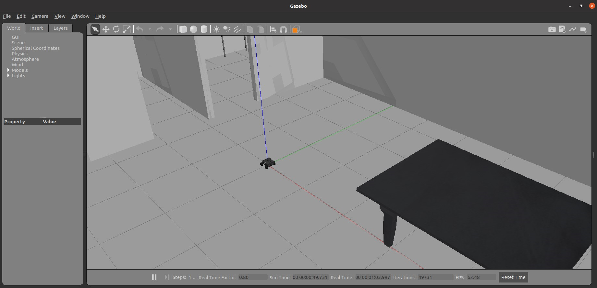
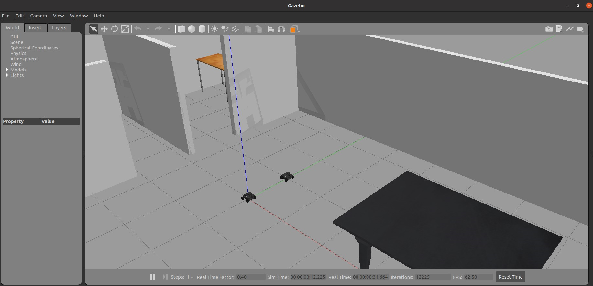

# nanoomni_description

#### 介绍
NanoOmni urdf and gazebo simulation environment

#### 使用说明

### 1.  display urdf in rviz
roslaunch nanoomni_description display.launch 

### 2.  simulation one robot in Gazebo
roslaunch nanoomni_description simulation.launch 

### 3.  simulation two robot in Gazebo
roslaunch nanoomni_description two_robot_simulation.launch 

