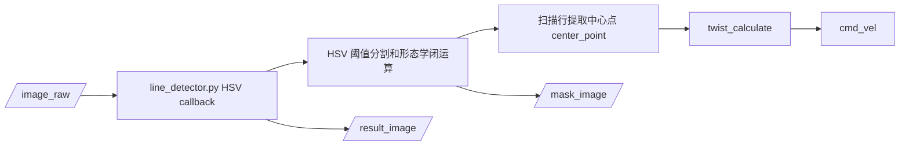
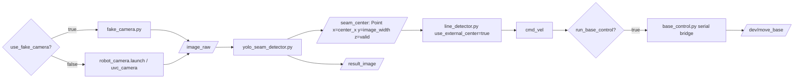
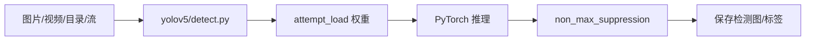
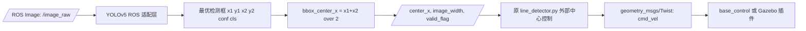

# 视觉代码与 YOLOv5 接入前梳理报告

生成日期：2026-04-26

本报告只做静态梳理和分析。未修改任何已有源码、launch、config、package.xml、CMakeLists.txt，也未删除旧文件。唯一新增内容是本报告文件。

## 1. 项目目录结构梳理

### 1.1 仓库根目录

当前 `bsnew/` 根目录关键内容如下：

| 路径 | 类型 | 作用判断 |
| --- | --- | --- |
| `catkin_ws/` | 目录 | ROS1 catkin 工作区，后续编译必须从这里执行 `catkin_make` |
| `catkin_ws/src/` | 目录 | ROS1 package 所在目录 |
| `yolo/` | 目录 | 旧 YOLO/Ultralytics 代码、训练/检测脚本、帧图像素材 |
| `yolov5/` | 目录 | 新加入的 YOLOv5 v6.0 代码仓库 |
| `models/` | 目录 | 当前权重存放目录，发现 `models/seam_best.pt` |
| `thesis_handoff/` | 目录 | 论文交接材料，不属于运行主链路 |
| `README.md` | 文件 | 项目运行说明，但部分描述仍提到旧 `yolo/` 示例路径 |
| `AGENTS.md` | 文件 | 项目工作规则 |
| `原视频.mp4` | 文件 | 参考原始视频，不应随意修改 |
| `识别视频.mp4` | 文件 | 参考识别视频，不应随意修改 |

### 1.2 `yolo/` 目录

`yolo/` 存在，内容是较完整的 Ultralytics 风格代码树，并带有项目脚本和帧素材：

| 路径 | 作用判断 |
| --- | --- |
| `yolo/ultralytics/` | 旧 Ultralytics/YOLO 代码库，含大量模型、训练、推理、工具模块 |
| `yolo/Detect.py` | 旧离线检测示例，使用 `from ultralytics import YOLO` |
| `yolo/train.py` | 旧训练示例，数据集路径为 Windows 路径 `D:\...`，不适合作为当前 Ubuntu ROS 部署入口 |
| `yolo/FPS.py` | 旧模型速度测试脚本 |
| `yolo/CrossLineCount.py`、`RegionCount.py`、`HeatPhoto.py`、`heatmap.py`、`track.py` | 旧 YOLO 应用/演示脚本 |
| `yolo/frames/` | 从视频提取的帧图像，共 353 张 |
| `yolo/pyproject.toml`、`README.md` | Ultralytics 工程配置和说明 |

结论：`yolo/` 更像旧实验/训练/离线识别代码库，不是当前推荐的 YOLOv5 ROS1 主入口。

### 1.3 `yolov5/` 目录

`yolov5/` 存在，Git 标识为 `v6.0`，提交短哈希 `956be8e`。关键内容如下：

| 路径 | 作用判断 |
| --- | --- |
| `yolov5/detect.py` | YOLOv5 官方离线检测入口，支持图片、视频、目录、流 |
| `yolov5/train.py` | YOLOv5 官方训练入口 |
| `yolov5/models/` | YOLOv5 网络结构与加载逻辑 |
| `yolov5/models/experimental.py` | `attempt_load()` 所在文件，被 ROS 适配脚本调用 |
| `yolov5/utils/` | YOLOv5 推理预处理、NMS、坐标缩放、设备选择等工具 |
| `yolov5/requirements.txt` | YOLOv5 依赖，包含 `torch`、`torchvision`、`opencv-python` 等 |
| `yolov5/data/*.yaml` | 官方示例数据集配置，未发现焊缝专用 data.yaml |

结论：`yolov5/` 是普通 YOLOv5 v6.0 代码仓库，本身不是 ROS 节点。当前 ROS 化逻辑不在 `yolov5/` 内，而在 `robot_vision/scripts/yolo_seam_detector.py`。

### 1.4 `catkin_ws/src/` 下 ROS1 package

| Package | 路径 | 作用判断 |
| --- | --- | --- |
| `robot_vision` | `catkin_ws/src/robot_vision/` | 主视觉包，包含相机 launch、HSV 旧视觉、YOLO 适配节点、主链路 launch |
| `base_control` | `catkin_ws/src/base_control/` | 底盘串口控制桥，订阅 `cmd_vel` 并发送到底盘 |
| `nanoomni_description` | `catkin_ws/src/nanoomni_description/` | 机器人描述和 Gazebo 仿真支持，不是主焊缝控制包 |
| `robot_simulation` | `catkin_ws/src/robot_simulation/` | Stage 仿真环境，偏通用移动机器人仿真 |
| `robot_navigation` | `catkin_ws/src/robot_navigation/` | 导航、SLAM、move_base 相关，不是焊缝主链路 |
| `lidar/*` | `catkin_ws/src/lidar/` | 雷达驱动包 |
| `bingda_tutorials` | `catkin_ws/src/bingda_tutorials/` | 教程/示例包，含重复的 description 资源 |

视觉相关 package：主要是 `robot_vision`，其次 `nanoomni_description` 中有 Gazebo 相机插件。

控制相关 package：主链路是 `robot_vision` 中的 `line_detector.py` 和 `base_control`。

描述/仿真相关 package：`nanoomni_description`、`robot_simulation`、部分 `robot_navigation`。

## 2. 视觉相关文件清单

| 文件路径 | 视觉类别 | 主要功能 | 输入 | 输出 | ROS1 节点 | 被 launch 引用 | 可能是当前主视觉入口 | 置信度 |
| --- | --- | --- | --- | --- | --- | --- | --- | --- |
| `catkin_ws/src/robot_vision/scripts/yolo_seam_detector.py` | 新 YOLOv5 ROS 适配/兼容旧 Ultralytics | 订阅 ROS 图像，加载 YOLO，推理，输出检测框中心 | `/image_raw` 或参数 `~image_topic` | `/seam_center`、`/result_image` | 是 | `seam_tracking.launch` | 是，当前最可能主视觉前端 | 高 |
| `catkin_ws/src/robot_vision/scripts/line_detector.py` | HSV 旧视觉 + 控制 | 默认模式下做 HSV 分割并直接控制；外部中心模式下只做控制 | 默认 `/image_raw`；外部模式 `/seam_center` | `cmd_vel`、`/result_image`、`/mask_image` | 是 | `line_follow.launch`、`seam_tracking.launch` | 在 `line_follow.launch` 中是旧主视觉；在 `seam_tracking.launch` 中不是视觉前端 | 高 |
| `catkin_ws/src/robot_vision/scripts/fake_camera.py` | 普通图像输入 | 循环发布静态测试图 | `~image_path`，默认 `bingda.png` | `/image_raw` | 是 | `fake_camera.launch`、`seam_tracking.launch` | 不是视觉算法，是调试图像源 | 高 |
| `catkin_ws/src/robot_vision/launch/robot_camera.launch` | 相机输入 | 启动 `uvc_camera_node` | `/dev/video*` | `/image_raw`、`/camera_info` | launch | 被 `seam_tracking.launch` include | 图像源入口 | 高 |
| `catkin_ws/src/robot_vision/launch/seam_tracking.launch` | 集成入口 | 组织相机或假相机、YOLO 节点、控制节点、可选底盘 | launch 参数 | 节点链路 | launch | 用户直接 roslaunch | 当前最可能主入口 | 高 |
| `catkin_ws/src/robot_vision/launch/line_follow.launch` | HSV 旧视觉入口 | 启动 `line_detector.py` 的 HSV 模式和图像压缩转发 | `/image_raw` | `cmd_vel`、`mask_image`、`result_image` | launch | 用户可直接启动 | 旧入口，不建议作为 YOLOv5 主入口 | 高 |
| `catkin_ws/src/robot_vision/config/line_hsv.cfg` | HSV 参数 | 动态调节 HSV 阈值 | dynamic_reconfigure | HSV 参数 | 配置 | `CMakeLists.txt` 生成 cfg | 旧 HSV 支撑配置 | 高 |
| `catkin_ws/src/robot_vision/config/astrapro.yaml`、`csi72.yaml` | 相机标定 | 给 `uvc_camera` 使用的相机内参 | camera_info_url | `/camera_info` | 配置 | `robot_camera.launch` | 图像输入支撑 | 高 |
| `catkin_ws/src/robot_vision/scripts/cv_bridge_test.py` | 普通图像显示/测试 | 测试 cv_bridge，画圆并发布图像 | `/image_raw` | `cv_bridge_image` | 是 | 未发现主 launch 引用 | 非主入口 | 中 |
| `catkin_ws/src/robot_vision/scripts/face_detector.py` | 其他视觉示例 | Haar 人脸检测 | `input_rgb_image` | `cv_bridge_image` | 是 | `face_detector.launch` | 非焊缝入口 | 高 |
| `catkin_ws/src/robot_vision/launch/opencv_apps/*.launch` | OpenCV 示例 | 调用 `opencv_apps` 各种图像处理节点 | `image_raw` | 各 opencv_apps 输出 | launch | 独立示例 | 非主入口 | 高 |
| `yolov5/detect.py` | 新 YOLOv5 离线检测 | 官方图片/视频/流检测脚本 | 文件、目录、视频、摄像头流 | 保存图像/标签等 | 否 | 未被 ROS launch 直接引用 | 非 ROS 主入口 | 高 |
| `yolov5/train.py` | 新 YOLOv5 训练 | 官方训练脚本 | data yaml、权重、图片标签 | 训练权重 | 否 | 未被 ROS launch 引用 | 非运行入口 | 高 |
| `yolov5/models/experimental.py` | 新 YOLOv5 模型加载 | 提供 `attempt_load()` | `.pt` 权重 | PyTorch model | 否 | 被 `yolo_seam_detector.py` import | 关键依赖，不是节点 | 高 |
| `yolov5/utils/general.py`、`utils/augmentations.py`、`utils/torch_utils.py` | 新 YOLOv5 推理工具 | NMS、letterbox、坐标缩放、设备选择 | tensor/image | 后处理结果 | 否 | 被 `yolo_seam_detector.py` import | 关键依赖，不是节点 | 高 |
| `models/seam_best.pt` | 新权重 | 当前发现的 YOLO 权重 | PyTorch 加载 | 模型参数 | 否 | 通过 `model_path` 参数使用 | 主权重候选 | 高 |
| `yolo/Detect.py` | 旧 YOLO 离线检测 | 使用 `ultralytics.YOLO().predict()` | 文件路径 | `runs/detect` | 否 | 未发现 ROS launch 引用 | 旧离线入口 | 高 |
| `yolo/train.py` | 旧 YOLO 训练 | 使用 `ultralytics.YOLO().train()` | Windows 数据集路径 | `runs/train` | 否 | 未发现 ROS launch 引用 | 旧训练入口 | 高 |
| `yolo/FPS.py` | 旧 YOLO 性能测试 | 加载权重测延迟/FPS | `.pt` 权重 | 日志 | 否 | 未发现 ROS launch 引用 | 非主入口 | 高 |
| `yolo/CrossLineCount.py`、`RegionCount.py`、`HeatPhoto.py`、`heatmap.py`、`track.py` | 旧 YOLO 应用示例 | 计数、热力图、跟踪等 | 视频/图片 | 可视化结果 | 否 | 未发现 ROS launch 引用 | 非主入口 | 中 |
| `yolo/frames/*.png` | 图像素材 | 参考帧，共 353 张 | 无 | 图片 | 否 | 未发现 launch 引用 | 素材，不是入口 | 高 |
| `nanoomni_description/urdf/nanoomni_description.gazebo.xacro` | 仿真视觉输入 | Gazebo 相机插件发布 `image_raw` | Gazebo 渲染 | `image_raw`、`camera_info` | 仿真插件 | `nanoomni_description` 仿真 launch | 仿真支撑，不是主控制包 | 高 |

## 3. YOLOv5 相关文件清单与状态

### 3.1 YOLOv5 根目录

YOLOv5 根目录为：

```text
bsnew/yolov5/
```

检查结果：

| 检查项 | 结果 |
| --- | --- |
| 是否存在 `detect.py` | 存在 |
| 是否存在 `train.py` | 存在 |
| 是否存在 `models/` | 存在 |
| 是否存在 `utils/` | 存在 |
| 是否存在 `requirements.txt` | 存在 |
| Git 版本 | `v6.0` |
| 提交短哈希 | `956be8e` |
| 是否有 `weights/` 或自带 `best.pt` | 未在 `yolov5/` 下发现项目权重 |
| 是否有焊缝数据集 `data.yaml` | 未发现，只有官方示例数据集 yaml |

### 3.2 当前权重文件

当前发现的权重文件：

```text
bsnew/models/seam_best.pt
```

文件大小约 14 MB，类型显示为 PyTorch zip 格式权重文件。当前没有发现 `last.pt` 或其他 `.pt` 权重。

### 3.3 YOLOv5 当前是否 ROS 化

`yolov5/` 本身不是 ROS1 package，也没有 ROS 节点、`package.xml` 或 launch。

当前项目中已经存在一个 ROS1 适配脚本：

```text
catkin_ws/src/robot_vision/scripts/yolo_seam_detector.py
```

该脚本通过 `yolov5_repo_path` 把 `bsnew/yolov5/` 加入 `sys.path`，再导入：

```text
models.experimental.attempt_load
utils.general.non_max_suppression
utils.general.scale_coords
utils.general.check_img_size
utils.torch_utils.select_device
utils.augmentations.letterbox 或 utils.datasets.letterbox
```

因此，准确状态是：

```text
yolov5/ 是普通 YOLOv5 推理代码库；
robot_vision/scripts/yolo_seam_detector.py 是当前已经存在的 ROS1 YOLOv5 适配层。
```

### 3.4 YOLOv5 是否已经与 ROS1 控制链路连接

从静态代码看，`seam_tracking.launch` 已经把 YOLOv5 适配节点和原控制节点连接起来：

1. `yolo_seam_detector.py` 发布 `/seam_center`。
2. `line_detector.py` 在 `use_external_center=true` 时订阅 `/seam_center`。
3. `line_detector.py` 调用原 `twist_calculate()` 发布 `cmd_vel`。

但本环境没有 ROS Melodic，也没有 `torch`，所以没有做运行级验证。需要回到 Ubuntu 18.04 + ROS Melodic 环境验证。

## 4. 旧视觉代码清单

| 旧视觉文件 | 旧视觉类型 | 以前/当前作用 | 输出给控制的接口 | 是否仍被当前 launch 启动 | 为什么不能直接删 |
| --- | --- | --- | --- | --- | --- |
| `robot_vision/scripts/line_detector.py` | HSV 循线 + 控制 | 默认模式下既做 HSV 视觉，又直接算控制 | 直接调用 `twist_calculate(width, center)`，发布 `cmd_vel` | 被 `line_follow.launch` 启动；也被 `seam_tracking.launch` 作为控制节点启动 | 其中包含原控制律和 `cmd_vel` 输出，是后续必须保留的控制代码 |
| `robot_vision/launch/line_follow.launch` | HSV 旧入口 | 启动 HSV 线检测控制路径 | 启动 `line_detector.py` 默认模式 | 可以直接启动 | 可作为旧方案对照和备用，不宜删除 |
| `robot_vision/config/line_hsv.cfg` | HSV 参数 | 动态调节 HSV 阈值 | 影响 `line_detector.py` HSV 分割 | 通过 CMake 生成 dynamic_reconfigure 配置 | 旧 HSV 路径依赖它 |
| `yolo/Detect.py` | 旧 Ultralytics 离线检测 | 离线检测示例 | 无 ROS 控制接口 | 未发现 ROS launch 引用 | 可能保留训练/论文素材价值 |
| `yolo/train.py` | 旧 Ultralytics 训练 | 旧训练示例 | 无 ROS 控制接口 | 未发现 ROS launch 引用 | 可作为历史训练记录，删除风险不明 |
| `yolo/ultralytics/**` | 旧 YOLO 代码库 | 支撑旧 `yolo/` 脚本 | 无 ROS 控制接口 | 未发现主 launch 引用 | 大型依赖代码，删除可能破坏旧实验脚本 |
| `robot_vision/scripts/face_detector.py`、`cv_bridge_test.py` | 示例视觉 | OpenCV/人脸/cv_bridge 演示 | 无焊缝控制接口 | 单独 launch 或未引用 | 与主链路无关，但不是冲突源 |

旧 HSV 主视觉入口最明确的是：

```text
catkin_ws/src/robot_vision/launch/line_follow.launch
```

它启动 `line_detector.py` 默认模式。默认模式下 `line_detector.py` 订阅 `/image_raw`，内部做 HSV 阈值分割、扫描若干行找中心点，然后直接调用控制函数发布 `cmd_vel`。视觉和控制在同一个脚本中耦合。

## 5. 控制代码清单

| 文件路径 | 功能 | 输入来源 | 输出话题 | 控制公式或核心逻辑 | 是否应尽量保留 | 后续接 YOLOv5 所需输入 |
| --- | --- | --- | --- | --- | --- | --- |
| `robot_vision/scripts/line_detector.py` | 原视觉控制节点，当前也可作为外部中心控制节点 | HSV 模式：`/image_raw`；外部模式：`/seam_center` 的 `geometry_msgs/Point` | `cmd_vel` | `twist_calculate(width, center)`，中心稳定区内直行，偏离时计算角速度并分段调线速度 | 是，原控制主体在这里 | 最小输入是 `center_x + image_width + valid_flag` |
| `base_control/script/base_control.py` | 底盘串口执行接口 | `cmd_vel` 或 Ackermann 命令 | 串口 `/dev/move_base`，并发布 `odom`、`battery` 等 | `cmdCB()` 读取 `linear.x`、`linear.y`、`angular.z` 并打包发送 | 是，底盘接口稳定且不应改 | 不直接接视觉，只接 `cmd_vel` |
| `base_control/launch/base_control.launch` | 启动底盘接口 | launch 参数 | 启动 `base_control.py` | 订阅 `cmd_vel_topic` 参数指定的话题 | 是 | 保持 `cmd_vel_topic` 与控制节点一致 |
| `nanoomni_description/urdf/nanoomni_description.gazebo.xacro` | Gazebo 平面运动插件 | Gazebo 中的 `cmd_vel` | Gazebo 运动和 `odom` | `libgazebo_ros_planar_move.so` 订阅 `cmd_vel` | 仿真时保留 | 不接视觉，只接 `cmd_vel` |

### 5.1 控制部分现在到底需要什么输入

当前控制核心在 `line_detector.py` 的 `twist_calculate(width, center)`：

```text
width  = 图像横向参考中心，当前外部中心模式传入 image_width / 2.0
center = 目标中心横坐标，当前外部中心模式传入 Point.x
```

外部中心消息格式为 `geometry_msgs/Point`：

| 字段 | 含义 |
| --- | --- |
| `Point.x` | 目标中心横坐标 `center_x` |
| `Point.y` | 图像宽度 `image_width` |
| `Point.z` | 有效标志，`> 0.5` 表示有效 |

所以控制部分实际需要的是：

```text
center_x + image_width + valid_flag
```

不是单独的 bias，也不是完整图像。完整图像只在旧 HSV 模式下需要。

### 5.2 偏差和速度逻辑

在外部中心模式中：

```text
reference_x = image_width / 2.0
target_x = center_x
```

调用：

```text
twist_calculate(reference_x, target_x)
```

控制函数内部：

```text
if 0.95 < target_x / reference_x < 1.05:
    linear.x = 0.2
    angular.z = 0
else:
    angular.z = ((reference_x - target_x) / reference_x) / 2.0
    if abs(angular.z) < 0.2:
        linear.x = 0.2 - angular.z / 2.0
    else:
        linear.x = 0.1
```

因此控制使用的有符号偏差方向是：

```text
reference_x - target_x
```

如果目标在图像右侧，`target_x > reference_x`，则 `angular.z` 为负。实际左转/右转方向还要结合底盘坐标和相机安装方向实机确认。

### 5.3 安全停止逻辑

`line_detector.py` 已有两类安全停止：

| 逻辑 | 位置 | 行为 |
| --- | --- | --- |
| 无效中心停车 | `external_center_callback()` | `Point.z <= 0.5` 或宽度无效时发布零 `Twist` |
| 输入超时停车 | `external_center_watchdog()` | 外部中心超过 `external_center_timeout` 未更新时发布零 `Twist` |

## 6. Launch 和 Config 入口清单

| launch/config 路径 | 启动/配置内容 | 是否启动视觉 | 是否启动控制 | 是否启动仿真/rviz/gazebo | 入口判断 |
| --- | --- | --- | --- | --- | --- |
| `robot_vision/launch/seam_tracking.launch` | 可选真实相机/假相机，启动 `yolo_seam_detector.py`，启动 `line_detector.py` 外部中心模式，可选 include `base_control.launch` | 是，YOLO 适配视觉 | 是 | 否 | 当前最可能主入口，也最适合作为后续 YOLOv5 整合入口 |
| `robot_vision/launch/line_follow.launch` | 启动 `line_detector.py` 默认 HSV 模式，转发 mask/result 压缩图 | 是，HSV 旧视觉 | 是 | 否 | 旧 HSV 入口，后续应标记为备用 |
| `robot_vision/launch/fake_camera.launch` | 启动 `fake_camera.py` 发布静态图 | 图像源 | 否 | 否 | 调试图像源入口 |
| `robot_vision/launch/robot_camera.launch` | 启动 `uvc_camera_node`，读取相机标定 | 图像源 | 否 | 否 | 真实相机入口，被主 launch include |
| `robot_vision/launch/face_detector.launch` | 启动人脸检测示例 | 是，人脸检测 | 否 | 否 | 非焊缝入口 |
| `robot_vision/launch/opencv_apps/*.launch` | OpenCV apps 示例 | 是，通用图像处理 | 否 | 否 | 示例/备用，不是主入口 |
| `base_control/launch/base_control.launch` | 启动底盘串口桥 | 否 | 底盘执行 | 否 | 主链路可选底盘接口 |
| `nanoomni_description/launch/*.launch` | RViz/Gazebo 机器人模型 | 仿真相机可能发布图像 | Gazebo 插件接 `cmd_vel` | 是 | 仿真/描述支撑，不是主焊缝入口 |
| `robot_simulation/launch/*.launch` | Stage 仿真 | 否 | 仿真运动平台 | 是 | 通用仿真入口，不是视觉焊缝入口 |
| `robot_navigation/launch/*.launch` | SLAM、导航、move_base、雷达 | 否 | 导航控制 | 可接仿真 | 非焊缝主链路 |
| `robot_vision/config/line_hsv.cfg` | HSV 动态阈值 | 支撑 HSV | 间接影响控制 | 否 | 旧视觉配置 |
| `robot_vision/config/astrapro.yaml`、`csi72.yaml` | 相机标定 | 支撑相机 | 否 | 否 | 相机配置 |

当前最可能主入口：

```text
roslaunch robot_vision seam_tracking.launch
```

后续最适合作为 YOLOv5 整合入口的也是：

```text
catkin_ws/src/robot_vision/launch/seam_tracking.launch
```

## 7. 当前真实数据流

### 7.1 旧 HSV 视觉数据流，已经存在

由 `line_follow.launch` 启动时：



特点：视觉和控制在同一个 `line_detector.py` 中耦合。它不需要 `/seam_center`。

### 7.2 当前 `seam_tracking.launch` 数据流，静态存在

由 `seam_tracking.launch` 启动时：



特点：从静态代码看，这条链路已经把 YOLO 适配节点接到了原控制节点。运行是否成功取决于 ROS Melodic、Python3 `rospy/cv_bridge`、torch、权重和相机输入。

### 7.3 YOLOv5 当前独立数据流，已经存在但不是 ROS

`yolov5/detect.py` 的离线数据流：



特点：不订阅 ROS 图像，不发布 `/seam_center`，不发布 `cmd_vel`。

### 7.4 最小整合后的目标数据流，推荐目标

这条目标流与当前 `seam_tracking.launch` 的静态结构一致：



目前尚需验证的是运行环境是否能真正执行这条链路，而不是代码结构是否存在。

## 8. 当前主要混乱点

| 问题 | 所在文件/目录 | 影响 | 后续最稳处理 |
| --- | --- | --- | --- |
| `yolo/` 和 `yolov5/` 并存 | `yolo/`、`yolov5/` | 容易误以为两个都是主视觉入口 | 文档中明确：`yolov5/` 是当前 YOLOv5 依赖，`yolo/` 是旧实验/备用 |
| `yolov5/` 本身不是 ROS 节点 | `yolov5/` | 直接运行 `detect.py` 不能进入 ROS 控制链路 | 通过 `robot_vision/scripts/yolo_seam_detector.py` 做薄适配 |
| 旧 HSV 视觉和控制耦合 | `line_detector.py` | 同一脚本既能做旧视觉也能做控制，容易误判角色 | 保留脚本，主 launch 使用 `use_external_center=true` 让它只接外部中心 |
| 当前存在多个视觉 launch | `line_follow.launch`、`seam_tracking.launch`、`opencv_apps/*.launch` | 用户可能启动旧入口导致没有 YOLOv5 | README/报告中明确主入口为 `seam_tracking.launch` |
| 权重默认路径为绝对路径 | `seam_tracking.launch`、`yolo_seam_detector.py` | 迁移到别的用户名或目录可能失败 | 后续最小修改可改为 launch 参数显式传入，或使用项目相对路径说明 |
| README 部分示例仍提旧路径 | `README.md` | 运行时可能传错 `model_path` | 后续只改文档，明确 `models/seam_best.pt` |
| Python2/Python3 混用 | `line_detector.py`、`fake_camera.py` 是 Python2 风格；`yolo_seam_detector.py` 是 Python3 | ROS Melodic 默认 Python2，YOLOv5 需要 Python3，`rospy/cv_bridge` 兼容性是风险 | 不大改控制代码；在 Ubuntu 18.04 中验证 Python3 的 `rospy/cv_bridge` |
| 本环境无法完成运行验证 | 无 `/opt/ros/melodic`，无 `torch` | 只能做静态检查，不能确认模型加载和 ROS 节点运行 | 回到目标虚拟机验证 |
| 可能存在多个 `cmd_vel` 发布者 | `line_follow.launch`、`seam_tracking.launch`、`robot_navigation/move_base.launch` | 同时启动导航和焊缝控制会抢 `cmd_vel` | 焊缝测试时只启动一个控制入口 |
| `base_control.launch` 有可疑尾部文本 `</group>-->` | `base_control/launch/base_control.launch` | XML 可解析，但格式上像残留注释，roslaunch 运行仍需验证 | 本轮不改；后续实测若报错再最小修复 |

## 9. 后续最小整合方案建议

### 方案 A：最小改动方案，推荐

做法：

1. 保留 `line_detector.py` 原控制主体。
2. 保留 `yolo_seam_detector.py` 作为 YOLOv5 ROS 适配层。
3. 以 `seam_tracking.launch` 为主入口。
4. 后续只做文档和必要参数清理：明确权重放在 `models/seam_best.pt`，运行时显式传 `model_path` 和 `yolov5_repo_path`。
5. 如需改代码，仅修正明显路径默认值或 README 示例，不改控制公式。

优点：

| 项 | 说明 |
| --- | --- |
| 改动最小 | 当前代码结构已基本支持这条链路 |
| 控制风险低 | `twist_calculate()` 不需要重写 |
| 论文解释清楚 | 可表述为“YOLOv5 替换 HSV 视觉前端，控制后端复用” |
| 调试简单 | 可用 `use_fake_camera:=true` 测视觉和控制输出 |

缺点和风险：

| 项 | 说明 |
| --- | --- |
| Python 兼容风险 | Python3 YOLO 节点需要能 import `rospy`、`cv_bridge` |
| 权重加载风险 | 需要 torch 和 YOLOv5 v6.0 环境匹配 |
| 方向需实机验证 | `angular.z` 正负和相机安装方向要在实车确认 |

推荐程度：高。

### 方案 B：中等改动方案

做法：

1. 新增一个更明确命名的中心点控制适配节点，例如 `seam_center_controller.py`。
2. 只从 `line_detector.py` 中复用控制公式，或把控制公式以最小方式封装出来。
3. `line_detector.py` 继续保留为旧 HSV 路径。

优点：

| 项 | 说明 |
| --- | --- |
| 角色更清楚 | 视觉、控制文件边界更明确 |
| 降低误解 | `line_detector.py` 不再同时承担新链路中的控制角色 |

缺点和风险：

| 项 | 说明 |
| --- | --- |
| 改动比方案 A 大 | 需要新增/调整控制节点 |
| 有重复控制逻辑风险 | 如果复制公式，后续维护会分裂 |
| 不符合“尽量不动控制代码”的目标 | 对本科项目不是必要 |

推荐程度：中。

### 方案 C：重写视觉控制融合节点，不推荐

做法：

1. 新写一个节点同时加载 YOLOv5、推理、算偏差、发布 `cmd_vel`。
2. 不再使用 `line_detector.py` 的控制逻辑。

优点：

| 项 | 说明 |
| --- | --- |
| 单文件闭环 | 表面上入口简单 |

缺点和风险：

| 项 | 说明 |
| --- | --- |
| 违背最高优先级约束 | 会重写稳定控制代码 |
| 回归风险高 | 速度、方向、安全停车都要重新验证 |
| 论文和代码证据弱 | 不能体现“复用原控制链路” |

推荐程度：低，不建议。

最终推荐：方案 A。理由是当前仓库已经有 YOLOv5 ROS 适配脚本和外部中心控制模式，最小整合点就是 `/seam_center`，控制代码只需要接收 `center_x + image_width + valid_flag`。

## 10. 不建议立即修改的原因

1. 当前请求目标是梳理和报告，不是接入。
2. 静态代码显示主链路结构已经存在，贸然修改可能引入新问题。
3. 本环境缺少 ROS Melodic 和 torch，不能验证修改后的运行行为。
4. 原控制代码承担 `cmd_vel` 输出和安全停车，后续应尽量保持不动。
5. `yolo/` 旧代码和 `line_follow.launch` 仍有历史/备用价值，删除收益低、风险高。

## 11. 下一步如果确认方案后，应如何执行

建议下一轮按下面顺序执行，而不是直接重构：

1. 在 Ubuntu 18.04 + ROS Melodic 虚拟机确认依赖：

```bash
python3 -c "import torch; print(torch.__version__)"
python3 -c "import cv2; print(cv2.__version__)"
python3 -c "import sys; sys.path.insert(0, '/home/bn/bsnew/yolov5'); from models.experimental import attempt_load; print('yolov5 import ok')"
```

2. 编译 catkin 工作区：

```bash
cd ~/bsnew/catkin_ws
source /opt/ros/melodic/setup.bash
catkin_make
source devel/setup.bash
```

3. 先用假相机启动主链路，不接底盘：

```bash
roslaunch robot_vision seam_tracking.launch \
  use_fake_camera:=true \
  run_base_control:=false \
  detector_backend:=yolov5 \
  yolov5_repo_path:=/home/bn/bsnew/yolov5 \
  model_path:=/home/bn/bsnew/models/seam_best.pt \
  device:=cpu
```

4. 观察中间输出：

```bash
rostopic echo /seam_center
rostopic echo cmd_vel
rqt_image_view /result_image
```

5. 只在假相机和真实相机检测都正常后，再打开：

```bash
run_base_control:=true
```

## 12. 总结判断

1. 当前项目中视觉相关代码主要集中在 `robot_vision`、`yolo/`、`yolov5/` 和 `nanoomni_description` 的 Gazebo 相机插件。
2. 新 YOLOv5 当前状态是：`yolov5/` 为普通 YOLOv5 v6.0 依赖代码库，ROS 适配入口是 `robot_vision/scripts/yolo_seam_detector.py`。
3. 原控制代码需要的最小输入是 `center_x + image_width + valid_flag`，通过 `/seam_center` 的 `geometry_msgs/Point` 表达。
4. 当前主 launch 最可能是 `robot_vision/launch/seam_tracking.launch`。
5. 后续最推荐方案是保留 `line_detector.py` 控制主体，仅把 YOLOv5 适配层作为新视觉前端，使用 `/seam_center` 薄接口连接。
6. 下一轮如要修改，优先从 `README.md` 和 `seam_tracking.launch` 的默认路径/运行说明入手；除非实测发现 bug，否则不要动 `line_detector.py` 的控制公式。

