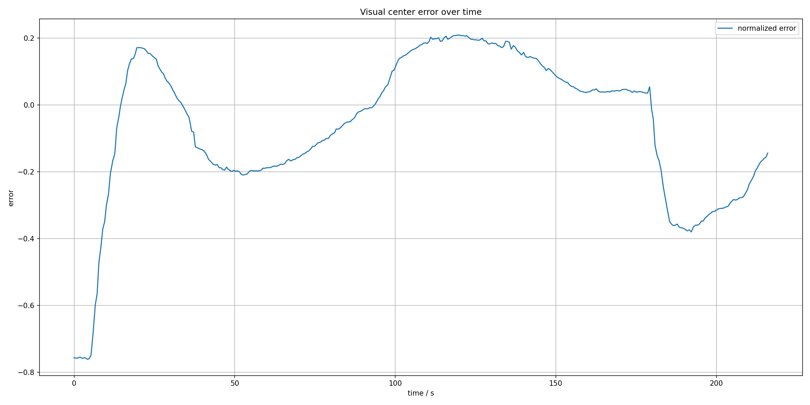
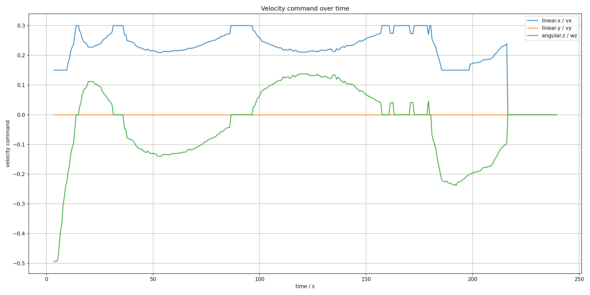
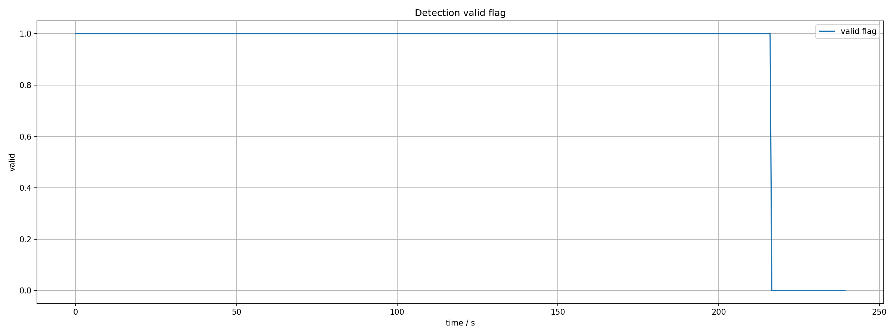
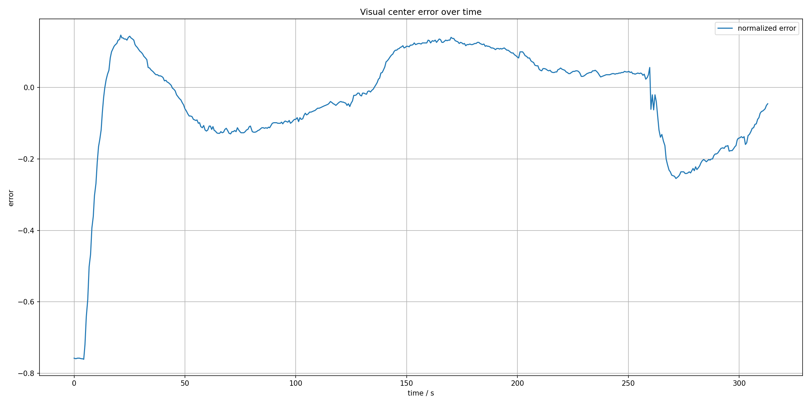
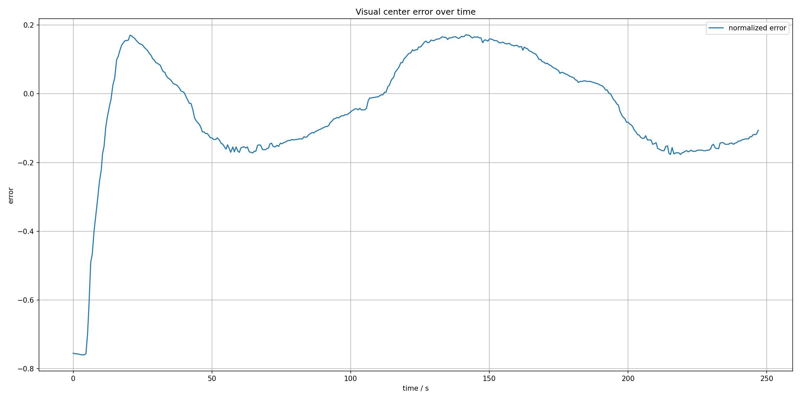
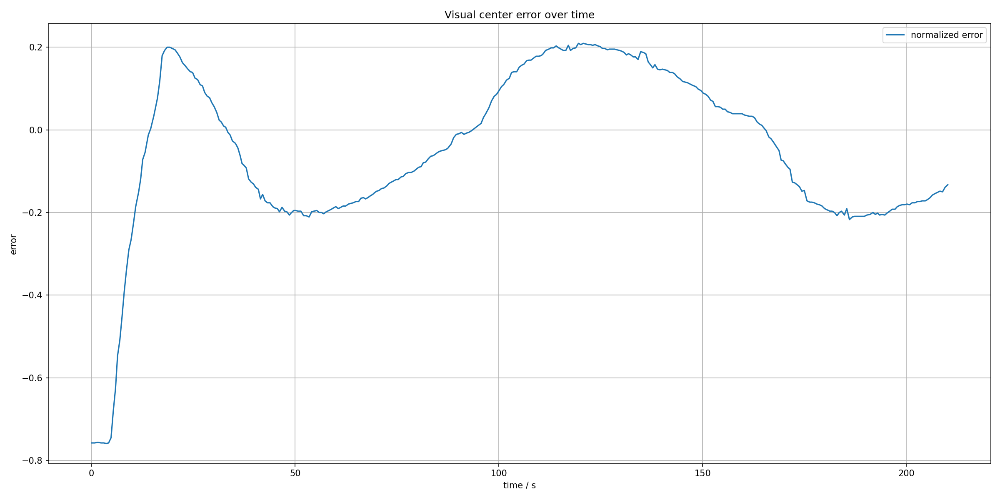

# 第四章 实机验证与仿真分析

前两章分别讨论了焊缝目标视觉感知和基于视觉偏差的控制方法。本章在方法分析基础上，结合系统实验记录，对系统实现环境、视觉识别功能、闭环运行过程、Gazebo 仿真支撑和参数影响进行分析。本文实验主要围绕 Gazebo 仿真条件下的软件闭环运行特性展开，重点考察视觉输出、偏差变化、速度响应和安全停止现象。

## 4.1 实验环境与总体流程

本文方法在 ROS1/catkin 环境下完成实现，整体过程可概括为图像输入、视觉识别、目标位置表征、偏差控制和运动响应五个环节。图像输入提供相机图像或仿真相机图像；视觉识别部分完成 YOLOv5 目标检测与检测框筛选；位置表征部分提取检测框横向中心并构建有效标志；控制部分根据目标中心与图像中心之间的偏差生成速度指令；运动响应部分则由底盘运动执行层或 Gazebo 仿真模型完成。

本文整理了 7 组实验记录：`baseline`、`opt_kp06`、`opt_kp065`、`slow_v016`、`speed_low`、`speed_mid` 和 `speed_high`。每组实验均保存参数设置、目标中心记录、速度记录、仿真时间记录、统计摘要和相关曲线图。其中，目标中心记录反映目标中心、图像宽度和检测有效标志，速度记录反映控制输出速度，统计摘要给出检测有效比例、有效阶段平均绝对偏差、速度范围、角速度范围、横向速度最大值和无效后停止状态等结果。

从验证角度看，系统需要依次确认以下内容。第一，输入图像是否能够进入视觉识别流程并产生有效检测结果。第二，检测框中心和图像宽度是否能够形成可记录的目标位置表征。第三，控制逻辑是否能够根据中心偏差生成前向速度和角速度。第四，上层控制是否保持 `linear.y=0`。第五，当检测无效或输入超时时，系统是否能够输出零速度。上述内容均可通过目标中心记录、速度记录和统计摘要进行分析。

## 4.2 实验方案与记录数据说明

本次 Gazebo 实验分为参数对比和速度影响两类。参数对比实验用于在相近前向速度约束下比较控制参数对中心偏差和速度输出的影响，包含 `baseline`、`opt_kp06`、`opt_kp065` 和 `slow_v016` 四组。速度影响实验用于在较优控制参数基本一致的条件下，比较不同前向速度约束下的跟踪现象，包含 `speed_low`、`speed_mid` 和 `speed_high` 三组。

参数对比实验的主要设置如表 4-1 所示。4 组实验均采用 Gazebo 半宽中段直线焊缝场景，模型权重为 `best_curve_bg_thin_real.pt`，目标类别参数为 `target_class_id=-1`，置信度阈值为 0.1，控制模式为 `vx_plus_wz_linear_y_zero`。其中，`baseline` 采用默认偏保守参数，`opt_kp06` 和 `opt_kp065` 提高比例增益、积分增益和速度耦合系数，用于观察偏差修正能力变化；`slow_v016` 保留为一组对照名称，但从参数文件看，其速度约束与 `opt_kp06` 一致，因此本章不把它解释为低速组。

表 4-1 参数对比实验主要设置

| 实验组 | $K_p$ | $K_i$ | 死区 | 积分限幅 | $v_0$ | $v_{\min}$ | $\alpha$ | 记录时长/s |
|---|---:|---:|---:|---:|---:|---:|---:|---:|
| baseline | 0.50 | 0.020 | 0.050 | 0.30 | 0.30 | 0.15 | 0.50 | 240 |
| opt_kp06 | 0.60 | 0.025 | 0.045 | 0.35 | 0.30 | 0.15 | 0.60 | 240 |
| opt_kp065 | 0.65 | 0.030 | 0.045 | 0.35 | 0.30 | 0.15 | 0.65 | 240 |
| slow_v016 | 0.60 | 0.025 | 0.045 | 0.35 | 0.30 | 0.15 | 0.60 | 240 |

速度影响实验的主要设置如表 4-2 所示。三组实验均采用 $K_p=0.65$、$K_i=0.03$、死区 0.045、积分限幅 0.35 和 $\alpha=0.65$，区别在于前向速度指令值和最低速度指令值不同。为了使不同速度下有较接近的运行覆盖范围，低速组记录时间较长，高速组记录时间较短。

表 4-2 速度影响实验主要设置

| 实验组 | $K_p$ | $K_i$ | $v_0$ | $v_{\min}$ | 记录时长/s | 仿真场景 |
|---|---:|---:|---:|---:|---:|---|
| speed_low | 0.65 | 0.030 | 0.20 | 0.10 | 360 | 半宽中段直线场景 |
| speed_mid | 0.65 | 0.030 | 0.25 | 0.12 | 288 | 半宽纹理场景 |
| speed_high | 0.65 | 0.030 | 0.30 | 0.15 | 240 | 半宽纹理场景 |

实验数据采用墙钟时间作为主要横轴。仿真时间记录显示，仿真实际推进时间明显小于墙钟记录时间，7 组实验估计实时率约为 0.102～0.108。这说明虚拟机中 Gazebo 运行速度低于真实时间，因此本章分析重点放在偏差、速度和有效标志的变化关系，而不把墙钟时间直接解释为真实机器人运动时间。

## 4.3 视觉识别功能验证

视觉识别功能验证的目标是确认系统能够从输入图像中识别焊缝目标区域，并生成后续控制所需的目标中心位置。本次记录中的目标中心数据包括时间、目标横向中心、图像宽度和检测有效标志。以 `baseline` 组为例，记录开始阶段的图像宽度为 640 px，检测有效时有效标志为 1，目标中心横坐标约在 561～562 px 附近。根据第二章公式，图像中心为 320 px，此时目标位于图像中心右侧较远位置，控制系统应生成相应方向的角速度修正。

从统计结果看，7 组实验的检测有效比例约为 0.842～0.903。其中，`baseline` 有效比例为 0.841709，`opt_kp06` 为 0.901015，`opt_kp065` 为 0.903308，`slow_v016` 为 0.901015，`speed_low` 为 0.869783，`speed_mid` 为 0.857732，`speed_high` 为 0.885787。该结果说明，在当前 Gazebo 焊缝场景和权重条件下，视觉模块能够在大部分记录阶段输出有效中心点，为控制闭环提供输入。

需要注意的是，检测有效比例反映的是控制过程接收到有效中心点的时间占比，不等同于 mAP、Precision、Recall 或 FPS 等视觉模型评价指标。在缺少人工标注真值的情况下，本节重点说明视觉检测环节能够在仿真场景中产生连续的中心点输出，并通过有效性标志参与后续控制分析。

## 4.4 焊缝跟踪闭环运行验证

焊缝跟踪闭环运行验证的目标是确认视觉输出能否驱动控制输出。系统在检测到有效焊缝目标后，将目标中心和图像宽度传递给控制部分；控制部分根据目标中心与图像中心之间的偏差生成速度指令。当目标位于图像中心附近时，系统输出前进速度；当目标偏离图像中心时，系统输出转向角速度；当目标无效或输入超时时，系统输出零速度。

从速度记录看，控制输出符合第三章给出的控制形式。7 组实验中 `linear.y_max_abs` 均为 0，说明上层控制采用前向速度 `linear.x` 与偏航角速度 `angular.z` 组合完成局部跟踪，横向速度通道未参与本次纠偏过程。各组 `linear.x` 最小值均为 0，最大值与实验参数一致：参数对比组和高速组最大值为 0.30，中速组最大值为 0.25，低速组最大值为 0.20。角速度最大绝对值约为 0.378～0.495，且各组角速度符号切换次数为 4，说明在本次场景中控制器根据目标偏差变化进行了有限次数的方向修正，没有出现频繁正负切换。

表 4-3 汇总了各组闭环运行统计结果。表中平均绝对偏差和末段平均绝对偏差均为有效检测阶段的归一化偏差统计，数值越小表示目标中心越接近图像中心；最大绝对偏差反映运行过程中出现过的最大偏离程度。由于实验没有提供真实路径误差和人工标注真值，表中偏差只能解释为图像中心偏差，不能解释为实际空间跟踪误差。

表 4-3 各组实验闭环运行统计结果

| 实验组 | 有效比例 | 平均绝对偏差 | 末段平均绝对偏差 | 最大绝对偏差 | `linear.x` 均值 | `angular.z` 最大绝对值 | 无效后停止 |
|---|---:|---:|---:|---:|---:|---:|---|
| baseline | 0.842 | 0.221 | 0.228 | 0.756 | 0.188 | 0.378 | 是 |
| opt_kp06 | 0.901 | 0.184 | 0.192 | 0.759 | 0.204 | 0.456 | 是 |
| opt_kp065 | 0.903 | 0.171 | 0.178 | 0.761 | 0.202 | 0.495 | 是 |
| slow_v016 | 0.901 | 0.181 | 0.184 | 0.761 | 0.205 | 0.455 | 是 |
| speed_low | 0.870 | 0.111 | 0.111 | 0.761 | 0.129 | 0.495 | 是 |
| speed_mid | 0.858 | 0.129 | 0.109 | 0.759 | 0.160 | 0.494 | 是 |
| speed_high | 0.886 | 0.157 | 0.130 | 0.759 | 0.200 | 0.494 | 是 |

从参数对比组看，`opt_kp065` 的平均绝对偏差为 0.171，低于 `baseline` 的 0.221，末段平均绝对偏差也由 0.228 降至 0.178。这说明在本次仿真场景中，提高比例增益、积分增益和速度耦合系数后，图像中心偏差有所减小。与此同时，`angular.z` 最大绝对值由 0.378 增至 0.495，说明更强的偏差修正也带来了更大的转向输出。因此，控制参数优化需要在偏差减小和转向强度之间折中，不能只根据平均偏差单独判断最优。

从速度影响组看，低速组 `speed_low` 的平均绝对偏差为 0.111，小于中速组 0.129 和高速组 0.157；中速组末段平均绝对偏差为 0.109，略低于低速组 0.111 和高速组 0.130。该现象说明，降低前向速度指令有利于控制器获得更多修正时间，从而减小平均视觉偏差；中等速度在末段偏差上也表现出较好的收敛趋势。由于三组实验场景和记录时长并不完全相同，且没有真实路径误差标注，本文只将其作为速度参数影响的现象分析，不给出严格最优速度结论。

## 4.5 Gazebo 仿真场景与曲线结果分析

Gazebo 仿真环境能够为机器人系统提供模型、传感器和运动执行支撑。本文系统包含机器人描述文件、Gazebo 平面运动插件、RGB 相机插件和焊缝相关场景文件。其中，相机插件可为视觉检测提供图像输入，平面运动插件可接收速度指令并驱动机器人模型运动。因此，仿真环境具备支撑感知—控制闭环调试的基础。

本次实验使用的主要场景包括半宽纹理焊缝场景和半宽中段直线焊缝场景。参数对比组主要采用 `seam_world_texture_half_width_mid_straight.world`，速度影响实验中的 `speed_mid` 和 `speed_high` 采用 `seam_world_texture_half_width.world`。这些场景能够为检测框中心、图像中心偏差和速度输出提供可重复的仿真输入。由于仿真场景主要用于复现视觉目标与运动响应之间的对应关系，实验结论仍以仿真条件下的运行现象分析为主。

图 4-1～图 4-3 给出了 `opt_kp065` 组的中心偏差、速度输出和检测有效标志曲线。中心偏差曲线显示，目标相对图像中心的偏差并非单调收敛，而是随着机器人运动和焊缝目标在视野中的位置变化出现正负变化。速度曲线显示，前向速度随角速度输出而变化，在转向强度较大时降低，在偏差较小时保持较高速度；检测有效标志曲线则用于观察无效检测阶段和停止状态。三类曲线共同说明，当前闭环不是简单恒速运动，而是存在由视觉偏差驱动的速度调节过程。

图 4-4～图 4-6 给出了速度影响实验中低速、中速和高速三组的中心偏差曲线。结合表 4-3 可见，低速组整体平均绝对偏差较小，高速组平均绝对偏差较大。这与视觉闭环控制的一般现象相符：前向速度越高，机器人在相同检测频率和控制频率下留给偏差修正的时间越短，目标更容易在图像中产生较大偏移。但由于仿真环境实时率较低，并且不同速度组记录时长和部分场景存在差异，本文只将这一现象作为控制参数调节依据，而不写成严格速度性能结论。

## 4.6 安全停止与异常情况分析

安全停止逻辑是焊缝跟踪系统的重要组成部分。当视觉检测环节未给出有效目标时，控制环节会依据无效标志或中心点输入超时输出零速度。实验摘要中 7 组记录的 `stop_after_invalid` 均为 `yes`，说明在本次实验记录中，无效检测后速度输出能够进入停止状态。

同时，各组记录中 `linear.x_min` 均为 0，说明速度输出中确实出现了停止状态；`linear.y_max_abs` 均为 0，进一步确认安全停止和正常跟踪过程中均未使用横向速度通道。该结果与第三章中的控制形式一致：上层焊缝跟踪控制输出为 $\mathbf{u}_k=[v_k,\ 0,\ \omega_k]^T$，目标丢失时输出 $\mathbf{u}_k=[0,\ 0,\ 0]^T$。

需要指出的是，本节的安全停止主要体现为上层速度输出层面的停止现象。硬件急停、工业安全认证以及真实船体表面吸附安全仍有待后续实机平台进一步验证。

## 4.7 实验结果与不足

综合本章实验结果，可以得到以下结论。第一，本文系统能够在 Gazebo 焊缝场景中形成由图像输入、YOLOv5 检测、中心点输出、偏差计算和速度控制组成的软件闭环。第二，中心记录表明视觉前端能够输出目标中心、图像宽度和有效标志，速度记录表明控制器能够输出前向速度和偏航角速度。第三，参数对比结果显示，适当提高控制增益和速度耦合系数可以降低平均视觉中心偏差，但同时会增大角速度输出。第四，速度影响结果显示，较低前向速度有利于减小平均视觉偏差，但也意味着运行效率降低。第五，无效检测后停止统计均为“是”，说明安全停止逻辑在记录数据中得到了体现。

实验不足主要包括以下方面。首先，实验仍以 Gazebo 仿真记录为主，真实船体表面爬壁条件下的闭环运行性能仍需进一步验证。其次，视觉模型缺少训练集、验证集、类别名称和 mAP、FPS 等检测评价指标，因此第四章主要分析检测有效标志和中心输出，而未对模型本身精度作定量评价。再次，实验没有人工标注的焊缝真实中心线或空间轨迹真值，因此平均绝对偏差主要反映图像中心偏差，而不能直接等同于真实空间跟踪误差。最后，仿真在虚拟机中实时率约为 0.102～0.108，墙钟时间与仿真时间差异较大，因此本章分析重点放在相对变化关系而非绝对运行时间。

正式论文定稿前，仍建议补充实机运行照片、相机安装情况、真实底盘运行视频、检测结果截图、模型训练与验证结果，以及真实或人工标注的焊缝中心误差统计。若能补充这些材料，第四章可进一步扩展为实机验证与定量评价。

## 4.8 本章小结

本章围绕系统验证与仿真分析进行了说明。首先介绍了实验环境与记录构成，然后根据参数对比和速度影响两类实验，分析了视觉检测有效比例、中心偏差、速度输出和安全停止状态。实验结果表明，在 Gazebo 仿真条件下，系统能够形成从 YOLOv5 检测框中心到视觉偏差控制输出的软件闭环；控制输出符合 $\mathbf{u}_k=[v_k,\ 0,\ \omega_k]^T$ 的控制形式；无效检测后能够进入停止状态。相关结论主要反映仿真条件下的闭环运行现象，船体表面实机性能、模型检测精度以及真实空间跟踪误差仍需在后续实验中进一步补充。
